# Stable Audio 3 推理架构

本文档描述 `stable-audio-lab` 仓库中 **推理（inference）** 的代码架构与数据流，便于理解从用户输入到输出音频的完整过程。

> 使用说明与 API 示例见 [inference.md](./workflows/inference.md)。

---

## 1. 总览

Stable Audio 3 的推理核心是一条 **latent 空间 Rectified Flow / RF Denoiser** 管线：

1. 文本与时长等条件经 **Conditioner** 编码
2. 可选音频经 **SAME 自编码器（AutoencoderPretransform）** 编码为 latent
3. **DiT（Diffusion Transformer）** 在 latent 空间做多步去噪
4. **SAME 解码器** 将 latent 还原为 44.1 kHz 波形

对外统一入口是 `StableAudioModel`（`stable_audio_3/model.py`），CLI 与 Gradio 都是对它的薄包装。

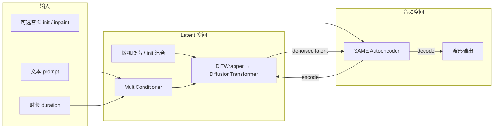

---

## 2. 推理入口

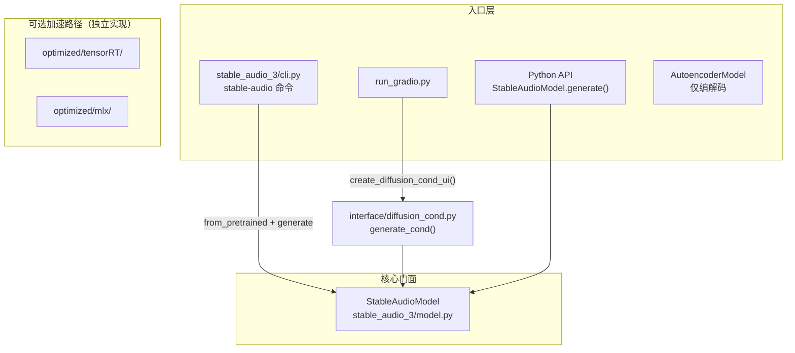

| 入口 | 文件 | 说明 |
|------|------|------|
| CLI | `stable_audio_3/cli.py` | `pyproject.toml` 注册为 `stable-audio` |
| Gradio Web UI | `run_gradio.py` → `interface/diffusion_cond.py` | 加载模型后调用 `generate_cond()` |
| Python API | `stable_audio_3/__init__.py` | 推荐：`StableAudioModel.from_pretrained()` |
| 独立 AE | `StableAudioModel` 同包的 `AutoencoderModel` | 不走扩散，仅 `encode()` / `decode()` |
| TensorRT | `optimized/tensorRT/scripts/` | CUDA 加速，逻辑镜像主路径 |
| MLX | `optimized/mlx/scripts/` | Apple Silicon 加速 |

---

## 3. 模型加载

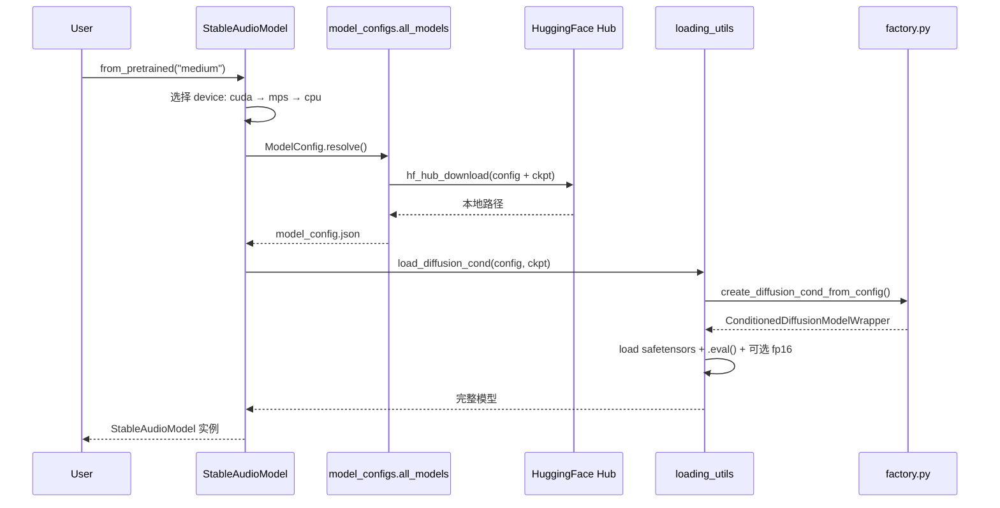

### 3.1 工厂组装（`factory.create_diffusion_cond_from_config`）

从 HuggingFace 下载的 `model_config.json` 驱动模型构建：

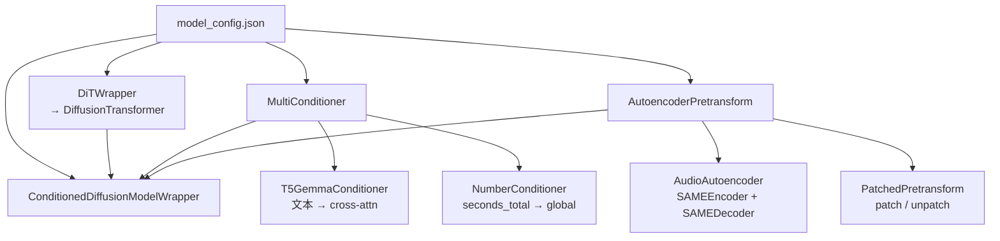

### 3.2 已注册模型（`model_configs.py`）

| 模型 ID | HuggingFace Repo |
|---------|------------------|
| `small-music` / `small-sfx` | `stabilityai/stable-audio-3-small-*` |
| `medium` | `stabilityai/stable-audio-3-medium` |
| `*-base` | 对应 `*-base` 变体（需更高 `cfg_scale` 与更多 steps） |
| `same-s` / `same-l` | 独立 SAME 自编码器 |

---

## 4. 核心类关系

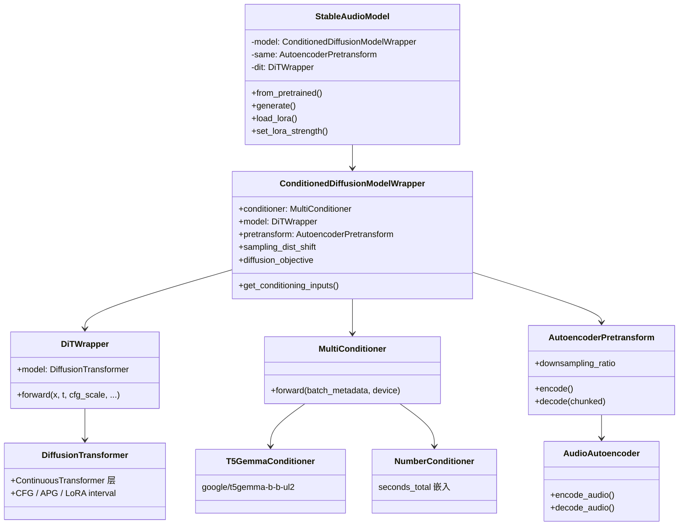

---

## 5. `generate()` 完整推理流水线

`StableAudioModel.generate()`（`model.py`）是推理的主编排函数。

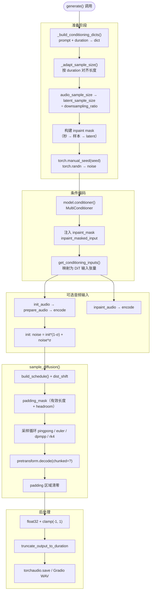

### 5.1 条件分两路

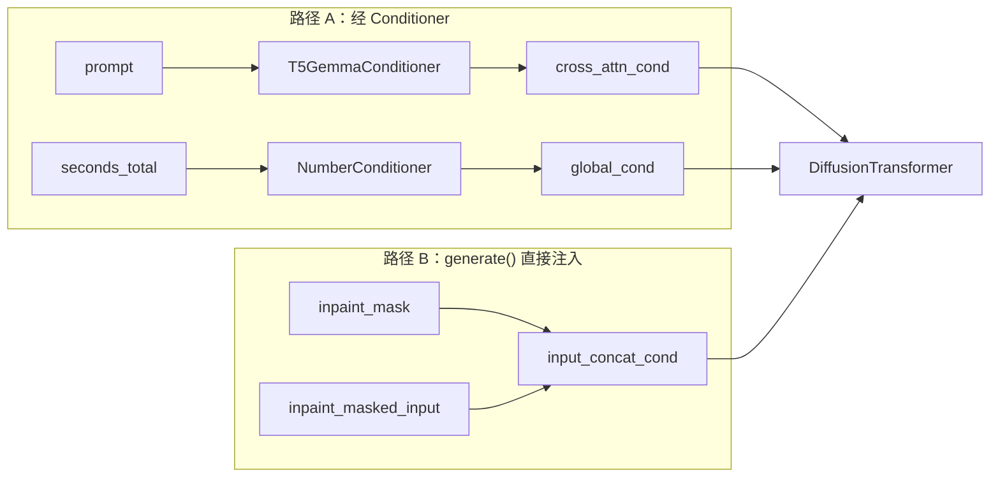

| 条件键 | 来源 | DiT 用途 |
|--------|------|----------|
| `prompt` | T5GemmaConditioner | Cross-attention |
| `seconds_total` | NumberConditioner | Global conditioning（控制生成长度） |
| `inpaint_mask` | `generate()` 内构建 | Channel concat（1=保留，0=重生成） |
| `inpaint_masked_input` | 编码后的 inpaint 音频 × mask | Channel concat |

---

## 6. 扩散采样（`inference/sampling.py`）

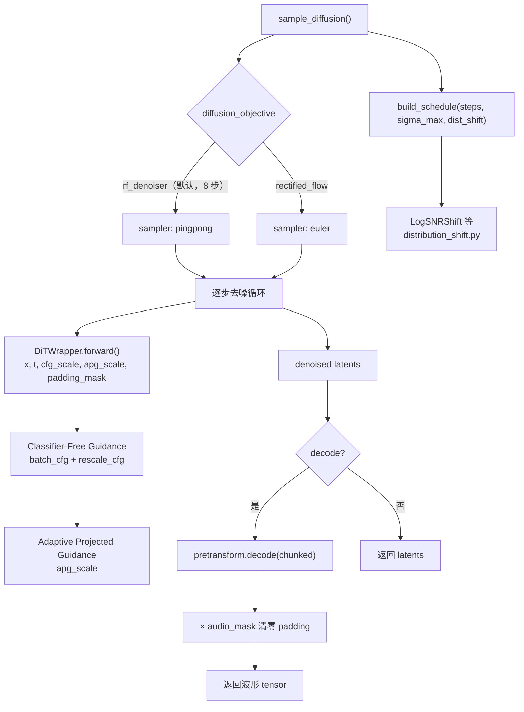

### 6.1 单步采样循环（概念）

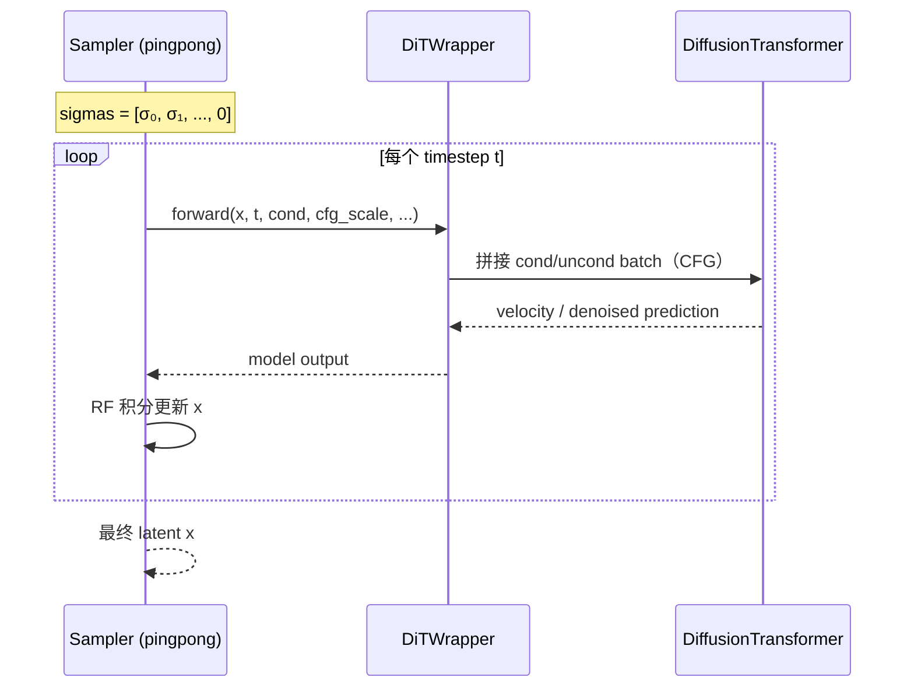

### 6.2 关键默认参数

| 参数 | 默认值 | 说明 |
|------|--------|------|
| `steps` | 8 | post-trained 模型蒸馏步数 |
| `cfg_scale` | 1.0 | post-trained 无需 CFG；`-base` 模型建议 ~7.0 |
| `sampler_type` | `pingpong`（rf_denoiser）/ `euler`（rectified_flow） | 自动按 objective 选择 |
| `init_noise_level` | 1.0 | A2A：越低越保留原音频 |
| `duration_padding_sec` | 6.0 | 有效长度外的 headroom |
| `chunked_decode` | `None` → 读 config | 分块解码降低 VRAM 峰值 |

---

## 7. 三种推理模式

### 7.1 Text-to-Audio（纯文本生成）

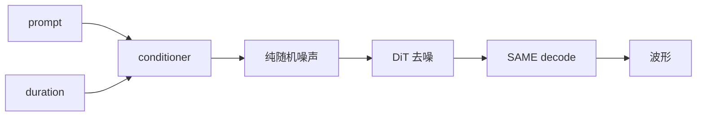

### 7.2 Audio-to-Audio（风格变换 / 变体）

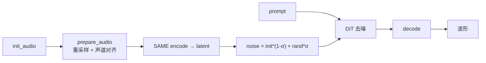

- `init_noise_level=1.0`：完全忽略 init，等同 T2A
- `init_noise_level` 越低：越接近原音频

### 7.3 Inpaint / Continuation（局部重生成 / 续写）

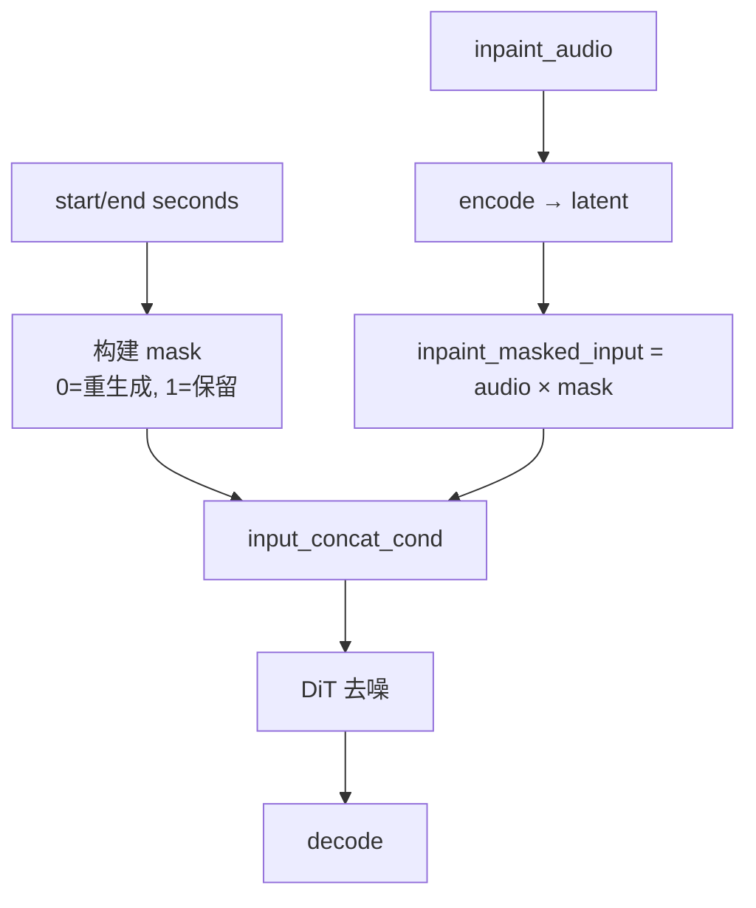

支持多个不连续区间（`inpaint_mask_start_seconds` / `end_seconds` 传 list）。

---

## 8. 预处理与后处理

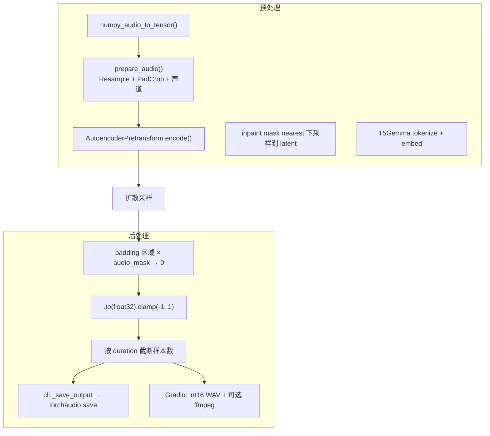

---

## 9. 设备与精度

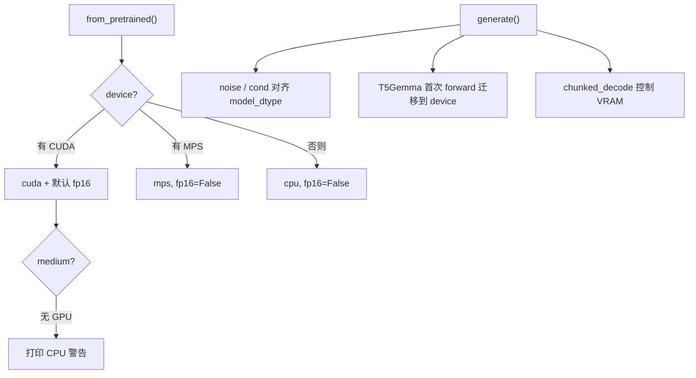

| 机制 | 位置 | 行为 |
|------|------|------|
| 自动选设备 | `StableAudioModel.from_pretrained()` | cuda → mps → cpu |
| FP16 | `loading_utils.load_diffusion_cond(model_half=True)` | 仅 CUDA；CPU/MPS 强制关闭 |
| TF32 关闭 | `StableAudioModel.__init__` | 数值稳定性 |
| Flash Attention | `medium` / SAME-L | 需安装 `flash-attn` |
| Gradio 清缓存 | `generate_cond()` | `torch.cuda.empty_cache()` |

---

## 10. LoRA（可选）

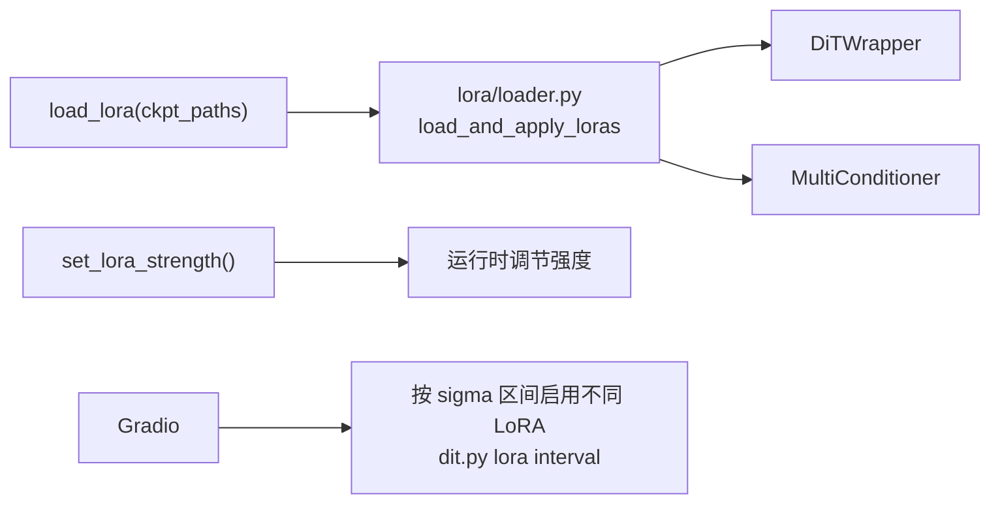

---

## 11. 关键源文件索引

```
stable_audio_3/
├── model.py                    # StableAudioModel.generate() — 推理编排
├── cli.py                      # CLI 入口
├── factory.py                  # 从 config 组装模型
├── loading_utils.py            # safetensors 加载
├── model_configs.py            # HF 模型注册表
├── inference/
│   ├── sampling.py             # sample_diffusion() — 采样 + 解码
│   ├── audio_utils.py          # prepare_audio, numpy 转换
│   └── distribution_shift.py   # LogSNRShift 等 schedule 扭曲
├── models/
│   ├── diffusion.py            # ConditionedDiffusionModelWrapper, DiTWrapper
│   ├── dit.py                  # DiffusionTransformer + CFG/APG
│   ├── conditioners.py         # T5Gemma, Number, MultiConditioner
│   ├── autoencoders.py         # SAME 编解码
│   ├── pretransforms.py        # AutoencoderPretransform
│   └── lora/                   # LoRA 加载与强度
└── interface/
    └── diffusion_cond.py       # Gradio generate_cond()

run_gradio.py                   # Gradio 启动入口
optimized/tensorRT/             # CUDA TensorRT 加速
optimized/mlx/                  # Apple Silicon MLX 加速
```

---

## 12. 数据形状速查

以 `medium` 模型为例（概念值，具体以 `model_config.json` 为准）：

| 阶段 | 形状 | 说明 |
|------|------|------|
| 输入音频 | `(B, C, T_audio)` | 44.1 kHz，T ≈ duration × 44100 |
| Latent | `(B, io_channels, T_latent)` | T_latent = T_audio / downsampling_ratio |
| 噪声 | 同 latent | `torch.randn` 初始化 |
| 输出音频 | `(B, C, T_audio)` | decode 后 float32，范围 [-1, 1] |

---

## 13. 训练 vs 推理架构差异

> 依据 [Stable Audio 3 技术报告](https://arxiv.org/abs/2605.17991)（`2605.17991v1.pdf`）与 `stable_audio_3/training/` 源码整理。

训练和推理 **共用同一套神经网络骨架**（SAME + DiT + Conditioner），但训练是一条多阶段、带辅助模块的学习管线，推理是一条精简的前向采样管线。差异主要在目标函数、采样方式、数据流，以及只在训练时存在的组件。

### 13.1 一句话对照

| 维度 | 训练架构 | 推理架构 |
|------|----------|----------|
| 网络主体 | SAME（冻结）+ DiT + T5Gemma + 时长 / inpaint 条件 | **完全相同** |
| 独有组件 | 判别器、Teacher、CLAP-on-latent、OT 配对、随机 mask 增广 | **无**，只有采样循环 |
| 优化目标 | 速度场 MSE → 蒸馏 MSE → 对抗 + CLAP | **无 loss**，迭代去噪 |
| 采样 | 每步随机采一个 `t`，单次前向 | 固定 8 步 **ping-pong**（post-trained） |
| CFG | 训练时 dropout（p=0.1）学无条件分支 | post-trained **默认不用 CFG** |

### 13.2 训练三阶段管线

技术报告 Figure 10：扩散模型训练分三阶段，最终产出 post-trained checkpoint（`diffusion_objective = rf_denoiser`）。

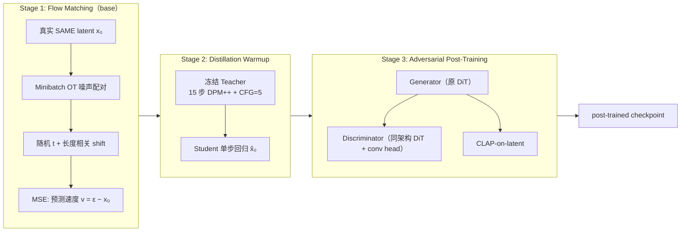

| 阶段 | 产物 | 推理时对应 checkpoint |
|------|------|----------------------|
| Flow Matching | `rectified_flow` base 模型 | `*-base`（多步 euler + 高 CFG） |
| Distillation Warmup | 单步 x̂₀ 能力（中间态） | 不单独发布 |
| Adversarial Post-Training | `rf_denoiser` post-trained | `small-music` / `medium` 等（8 步 pingpong） |

### 13.3 仅训练时存在的组件

| 组件 | 训练中的作用 | 推理时 |
|------|-------------|--------|
| **判别器 D** | 与 Generator 对抗，判断 latent 真假 | 不存在 |
| **Teacher 模型** | 蒸馏阶段生成 ODE 轨迹 | 不存在 |
| **CLAP loss** | 约束生成 latent 与 prompt 语义对齐 | 不存在（已 bake 进权重） |
| **OT coupling** | 批内重排噪声，拉直 flow 路径（`training/diffusion.py`） | 不存在 |
| **CFG dropout** | 10% 概率置零条件，学无条件分支 | post-trained 默认 `cfg_scale=1.0` |
| **随机 inpaint mask** | 80% 全生成 / 10% 随机段 / 10% 因果续写 | 用户指定 mask |
| **Silence augmentation** | 随机延长静音 latent（~4s 指数分布） | 固定 +6s padding，生成后截断 |
| **Masked loss** | padding 区不算 loss、attention mask | 只做 attention mask，不算 loss |

### 13.4 Base vs Post-trained 推理行为

| | **Base（Stage 1）** | **Post-trained（Stage 2+3）** |
|--|---------------------|-------------------------------|
| `diffusion_objective` | `rectified_flow` | `rf_denoiser` |
| 采样器 | `euler` 等 ODE 积分 | **`pingpong`** |
| 步数 | 50–100 步（技术报告） | **默认 8 步** |
| CFG | 需要（~7.0） | **不需要**（蒸馏时已内化 Teacher 的 CFG=5） |
| 模型学到什么 | 速度场 vθ，沿 ODE 多步积分 | 任意 t 下单步估计 x̂₀，再用 ping-pong 细化 |

Post-trained 推理核心（`inference/sampling.py`）：

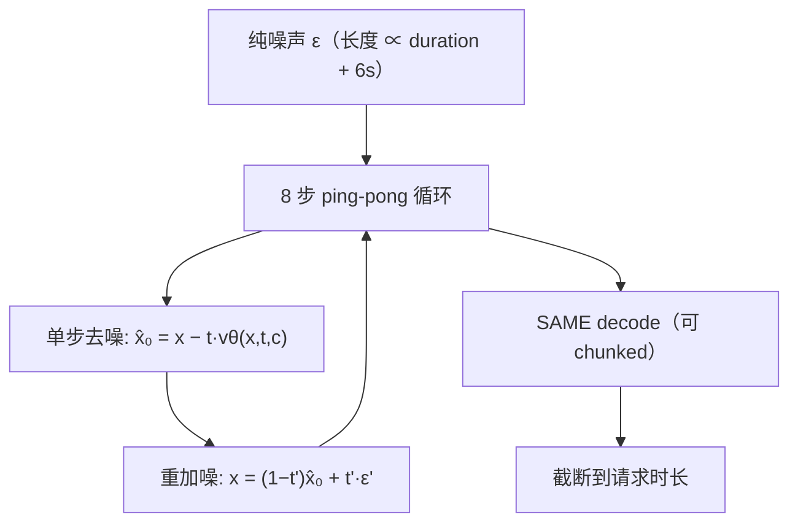

对抗后训练让模型具备 **xₜ → x̂₀ 单步能力**，但 **ε → x̂₀ 一步仍困难**；ping-pong 将「一大步」拆成多步「去噪 → 重加噪」，且具备自纠错性（技术报告 §4, Figure 14）。

### 13.5 时间步调度（train–inference mismatch）

| | 训练 | 推理 |
|--|------|------|
| `t` 采样 | 截断 logit-normal，**按序列长度做 per-element shift**（μ=0.5~1.15） | **logSNR 均匀** 的固定 8 点 schedule，**与长度无关** |
| 目的 | 覆盖大量噪声水平，长序列偏更高噪声 | 8 步里每步放置更重要 |

技术报告明确这是 **有意的 mismatch**，实践中效果可接受（§4）。

### 13.6 变长处理

| | 训练 | 推理 |
|--|------|------|
| 序列长度 | batch 内 pad 到统一长度 | `L = ⌈(d + 6s) · fs / 4096⌉` |
| 有效内容 | `Leff = ⌈d·fs/4096⌉`，其余 silence latent | 同左，生成后按 `d` 截断 |
| Attention | padding 区 mask 掉 | 同样 mask，但不算 loss |
| Loss | 只在有效信号区（+ inpaint 分区） | 无 |

### 13.7 SAME 与 Inpainting

**SAME**

- **扩散训练**：SAME **冻结**，数据为 **离线预编码** latent；`training/diffusion.py` 中 `pre_encoded=True` 时跳过 encode。
- **推理**：A2A / inpaint 时 **在线** `encode()` 输入音频；最后 **在线** `decode()` 出波形。

SAME 自身另有独立训练（频谱重建、对抗、diffusion alignment、语义回归、对比对齐五类 loss），推理时不涉及。

**Inpainting**

- **训练**：`models/inpainting.py` 的 `random_inpaint_mask()`，loss 分「生成区（m=0）」与「保留区（m=1）」两项（报告 Eq.5）。
- **推理**：`generate()` 内按 `inpaint_mask_start/end_seconds` 构建 mask，逻辑相同（257 维 local-additive 条件），但 **不再随机**。

### 13.8 前向次数与 CFG 开销

| | 训练 | 推理（post-trained） |
|--|------|---------------------|
| 每训练/采样步 | 1 次前向（+ CFG dropout） | 8 步 × 1 次前向/步 |
| Teacher（蒸馏） | 15 步 × CFG 5.0 | — |
| CFG 双倍 batch | 仅 base 推理需要 | **省掉**（对消费级部署关键，报告 §4） |

### 13.9 与训练代码的边界（源码索引）

推理路径 **不经过** 以下训练专用逻辑，但复用相同底层模块：

| 文件 | 训练专用 | 推理复用 |
|------|----------|----------|
| `training/diffusion.py` | `DiffusionCondTrainingWrapper.training_step()` | 验证/demo 时调用 `sample_diffusion()` |
| `models/inpainting.py` | `random_inpaint_mask()` | — |
| `data/utils.py` | batch padding mask 构建 | `compute_effective_seq_len_from_conditioning()` 用于 schedule |
| `interface/diffusion_cond.py` | — | `is_rf_denoiser` 切换 UI 默认参数 |

---

*文档基于 `stable-audio-lab` 源码与技术报告梳理，主推理路径为 PyTorch `StableAudioModel.generate()`。*
