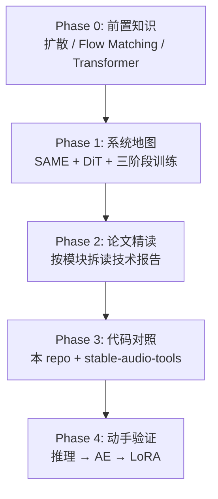

# Stable Audio 3 学习路线图

本文档给出理解 Stable Audio 3 **训练与推理架构**的推荐学习顺序，便于按阶段建立心智模型并动手验证。

> 推理架构详见 [inference-architecture.md](./inference-architecture.md)。概念概览见 [Model Overview](./guides/model-overview.md)。技术报告：[arXiv:2605.17991](https://arxiv.org/abs/2605.17991)。

**重要说明**：本仓库（`stable-audio-lab`）侧重 **推理与 LoRA 微调**；完整三阶段预训练（Flow Matching → 蒸馏 → 对抗后训练）在 [stable-audio-tools](https://github.com/Stability-AI/stable-audio-tools) 中。路线图按这一现实划分。

---

## 总览：四个阶段



**时间预期**（已有 ML 基础）：**2–4 周**可建立清晰心智模型；深入每个 loss 与实现细节，**1–2 个月**更合理。

---

## Phase 0：前置知识（3–5 天）

不必全部学完再开始，但以下概念会在读报告时反复出现：

| 主题 | 为什么要懂 | 建议材料 |
|------|-----------|----------|
| **Latent diffusion 基本范式** | 理解「先在 latent 生成，再 decode」 | [Model Overview](./guides/model-overview.md) |
| **Flow Matching / Rectified Flow** | Stage 1 核心目标：`v = ε − x₀` | 技术报告 §3.2；[Flow Matching 论文](https://arxiv.org/abs/2210.02747) |
| **Classifier-Free Guidance** | base 推理需 CFG≈7；post-trained 不用 | 报告 §3.5、§4 |
| **Transformer 条件注入** | AdaLN / cross-attn / 局部相加 | 报告 Figure 8；对照 DiT、FLUX 的 AdaLN |
| **LoRA** | 本 repo 唯一能完整跑的训练 | [LoRA Workflows](./workflows/lora.md) |

**可跳过或后补**：k-diffusion 细节、Sinkhorn OT 数学推导、CLAP 测地线距离——用到时再查即可。

---

## Phase 1：系统地图（1–2 天）

**目标**：脑子里有一张「谁训练谁、谁冻结谁」的图。

### 推荐阅读顺序（本 repo 内）

1. [Model Overview](./guides/model-overview.md) — 两部件 + 三阶段训练概览
2. [Inference Architecture](./inference-architecture.md) — §1–§5 推理主线
3. [Inference Architecture §13](./inference-architecture.md#13-训练-vs-推理架构差异) — 训练 vs 推理差异

### 三层结构

```
Layer A: SAME 自编码器（单独训练，扩散阶段冻结）
Layer B: DiT 扩散 Transformer（三阶段训练）
Layer C: 仅训练存在的辅助模块（Teacher、判别器、CLAP-on-latent）
```

### 三阶段训练对照

| 阶段 | 学什么 | 推理产物 |
|------|--------|----------|
| Flow Matching | 速度场 `vθ`，多步 ODE | `*-base` checkpoint |
| Distillation Warmup | 单步 `xt → x̂₀`（MSE） | 中间态，不单独发布 |
| Adversarial Post-Training | 对抗 + CLAP，少步高质量 | `small-music` / `medium` 等 |

---

## Phase 2：论文精读（约 1 周）

技术报告（仓库内 `2605.17991v1.pdf` 或 [arXiv](https://arxiv.org/abs/2605.17991)）建议 **按训练管线拆读**，不要从头到尾线性读：

| 顺序 | 章节 | 关注点 | 读完后应能回答 |
|------|------|--------|----------------|
| 1 | §2 Architecture + Fig.4–9 | DiT 三种条件通路、memory embeddings、inpaint | 条件从哪几条路进网络？ |
| 2 | §2.1 SAME + Fig.5–6 | TRB、4096×、五种 loss | 为什么 latent 既保真又「好生成」？ |
| 3 | §3.1 Variable-Length | padding mask、长度相关 t shift、silence aug | 变长训练解决了什么？ |
| 4 | §3.2 Flow Matching | `xt = (1-t)x₀ + tε`、OT、inpaint loss 拆分 | base 模型在优化什么？ |
| 5 | §3.3 Distillation | Teacher 15 步 DPM++ + CFG=5 | 为什么 post-trained 推理不用 CFG？ |
| 6 | §3.4 Adversarial | 判别器架构、CLAP-on-latent | 为什么 MSE 蒸馏不够？ |
| 7 | §4 Inference | ping-pong、logSNR schedule、train–inference mismatch | 8 步 pingpong 在干什么？ |

**配套 SAME 论文**（可选但推荐）：[SAME arXiv:2605.18613](https://arxiv.org/abs/2605.18613) — 补全 autoencoder 层。

每读完一节，回到 [Inference Architecture §13](./inference-architecture.md#13-训练-vs-推理架构差异)，用「训练时 / 推理时」各写一句话总结。

---

## Phase 3：代码对照（约 1–2 周）

### 3.1 本 repo（`stable-audio-lab`）— 推理 + 微调

按 **数据流** 读，不要按目录字母序：

| 顺序 | 文件 | 对应论文概念 |
|------|------|-------------|
| 1 | `stable_audio_3/model.py` → `generate()` | 推理编排、inpaint mask、条件注入 |
| 2 | `stable_audio_3/inference/sampling.py` | ping-pong、euler、schedule、decode |
| 3 | `stable_audio_3/models/dit.py` | AdaLN、CFG、velocity → x̂₀ |
| 4 | `stable_audio_3/models/conditioners.py` | T5Gemma、duration |
| 5 | `stable_audio_3/models/pretransforms.py` + `autoencoders.py` | SAME encode/decode |
| 6 | `stable_audio_3/training/diffusion.py` | 训练核心：`training_step()` |
| 7 | `scripts/train_lora.py` + [LoRA 文档](./workflows/lora.md) | 本 repo 唯一能完整跑的训练 |

`training/diffusion.py` 的 `training_step()` 建议对照报告 §3.1–3.2 逐段看：

| 代码 | 论文概念 |
|------|----------|
| `pre_encoded` / encode | 离线 latent |
| `ot_coupling` | §3.2 Minibatch OT |
| `dist_shift.shift(t, effective_seq_len)` | §3.1 长度相关 shift |
| `random_inpaint_mask()` | §3.2 inpaint 训练 |
| `targets = noise - diffusion_input` | Flow matching 速度目标 |
| `cfg_dropout_prob` | §3.5 CFG 训练 |

### 3.2 外部 repo — 完整预训练

完整 foundational 训练在 [stable-audio-tools](https://github.com/Stability-AI/stable-audio-tools)。若目标是理解 Stage 1–3 全流程（而不只是 LoRA），Phase 3 后半应切到该仓库，重点查找：

- 训练配置 YAML / `model_config.json` 样例
- SAME 预编码数据管线
- 蒸馏与对抗 post-training 脚本（若已开源）

本 repo 的 `stable_audio_3/training/` 仅含 `diffusion.py` 与 `utils.py`，**不足以覆盖完整三阶段**。

---

## Phase 4：动手验证（巩固理解）

按难度递增，每步验证一个假设：

| 步骤 | 做什么 | 验证的理解 |
|------|--------|-----------|
| **4.1 推理对比** | 同一 prompt：`medium` vs `medium-base`，对比 steps / cfg | post-trained vs base 行为差异 |
| **4.2 变长** | 生成 10s / 60s / 120s，看耗时与质量 | 变长推理 ≠ 固定 Lmax |
| **4.3 Inpaint** | 单段编辑 / 续写 | local-additive 条件在推理侧如何用 |
| **4.4 SAME 编解码** | `AutoencoderModel.from_pretrained("same-s")` | latent 空间长什么样 |
| **4.5 LoRA** | `scripts/train_lora.py` 小数据集 500–1000 step | 冻结 base + 只训 adapter |
| **4.6 读 loss 日志**（可选） | LoRA 或 SAT 训练中的 `mse_signal` / `mse_context_loss` | inpaint 双项 loss 直觉 |

**不建议一开始就做的**：从零训练 medium、自行实现判别器 post-training——成本与工程复杂度极高。

相关文档：

- [Inference Workflows](./workflows/inference.md)
- [Autoencoder Workflows](./workflows/autoencoder.md)
- [LoRA Workflows](./workflows/lora.md)

---

## 按目标选路线

| 你的目标 | 重点 Phase | 可跳过 |
|----------|-----------|--------|
| **会用 / 部署推理** | 0（浅）+ 1 + 本 repo Phase 3 前半 | 论文 §3.3–3.4 细节 |
| **做 LoRA / 风格微调** | 0 + 1 + `lora.md` + `training/diffusion.py` 概览 | OT、对抗训练细节 |
| **研究完整训练管线** | 全部 + stable-audio-tools + SAME 论文 | — |
| **写论文 / 复现** | 全部 + 报告 §5 实验 + §3.5 实现细节 | — |

---

## 常见误区

1. **把推理架构图当成训练架构图** — 训练多判别器、Teacher、随机 mask、masked loss。
2. **以为本 repo 能训 full model** — 完整三阶段在 stable-audio-tools；这里主要是 LoRA。
3. **先啃 ping-pong 再懂 flow matching** — 顺序反了；ping-pong 是 post-training 的推理技巧。
4. **忽略 SAME** — 4096× latent 是整个系统的前提；不懂 SAME，DiT 输入空间很难理解。
5. **base 和 post-trained 混用参数** — base 要多步 + 高 CFG；post-trained 默认 8 步 + CFG≈1。

---

## 建议的一周节奏（示例）

| 天 | 任务 |
|----|------|
| D1 | `model-overview.md` + 报告 §1–§2 + Fig.4 |
| D2 | 报告 §2.1 SAME + `autoencoders.py` 粗读 |
| D3 | 报告 §3.1–3.2 + `training/diffusion.py` `training_step()` |
| D4 | 报告 §3.3–3.4 + [inference-architecture.md §13](./inference-architecture.md#13-训练-vs-推理架构差异) |
| D5 | 报告 §4 + `sampling.py` ping-pong |
| D6 | 跑推理对比（base vs post-trained）+ inpaint |
| D7 | 读 `lora.md`，小数据集试训 LoRA |

---

## 相关文档索引

| 文档 | 内容 |
|------|------|
| [inference-architecture.md](./inference-architecture.md) | 推理架构 + 训练 vs 推理差异（§13） |
| [guides/model-overview.md](./guides/model-overview.md) | 模型概念与三阶段训练简介 |
| [workflows/inference.md](./workflows/inference.md) | 推理 API 与模式 |
| [workflows/lora.md](./workflows/lora.md) | LoRA 微调 |
| [workflows/autoencoder.md](./workflows/autoencoder.md) | SAME 编解码 |
| [README.md](../README.md) | 模型表、硬件要求、安装 |

---

*路线图基于 `stable-audio-lab` 文档、源码与技术报告 [arXiv:2605.17991](https://arxiv.org/abs/2605.17991) 整理。*
